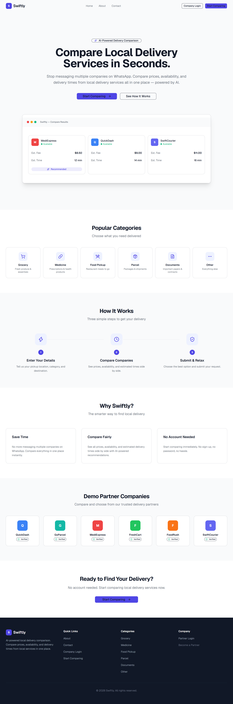
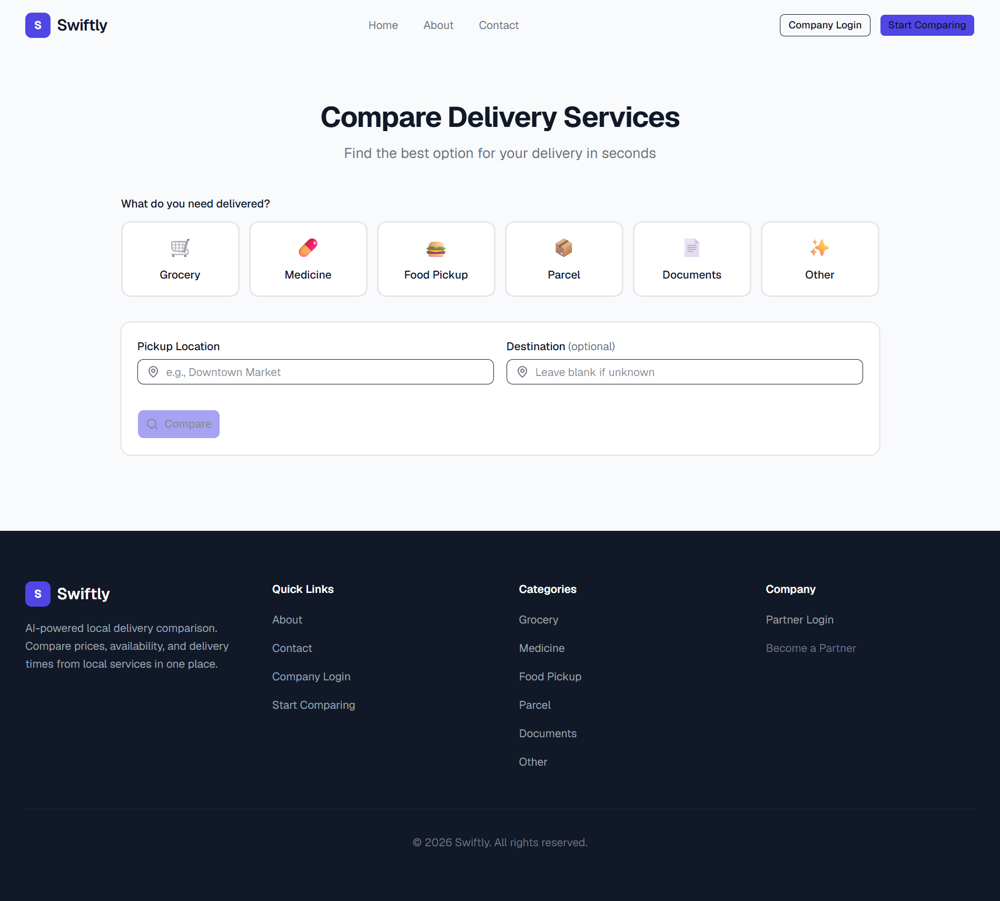
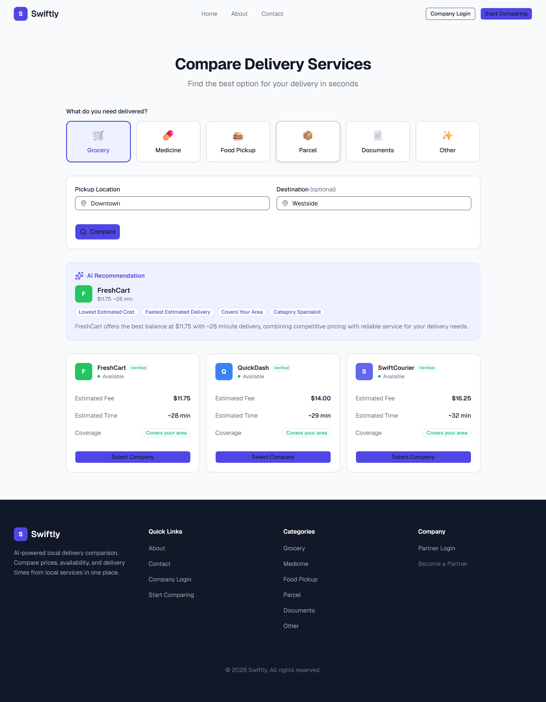
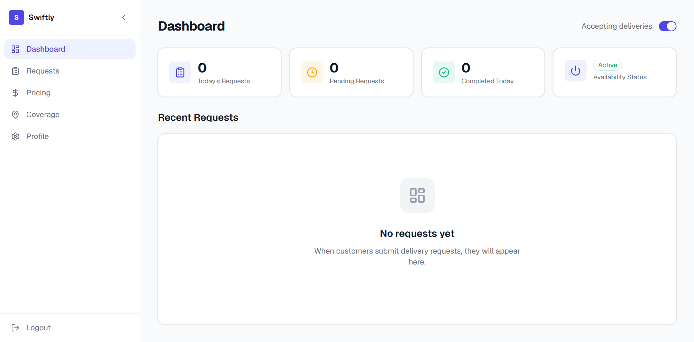
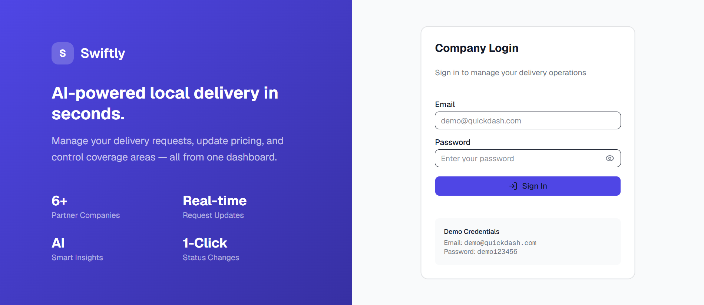
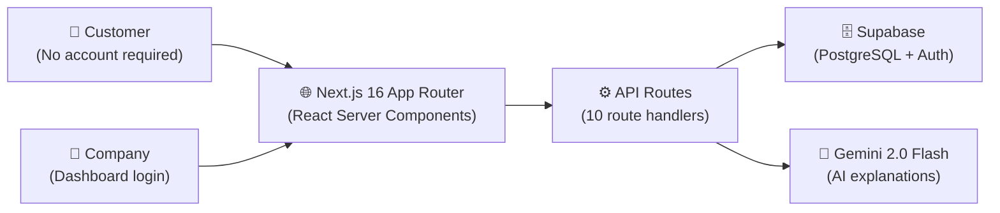

<p align="center">
  
  
  
  
  
  
  
</p>

# Swiftly

**AI-powered local delivery comparison in seconds.**

Swiftly aggregates local delivery companies into a single comparison interface. Enter your pickup and destination, choose a category, and compare pricing, estimated times, and availability across multiple companies — no account required.

---

## Table of Contents

- [Live Demo](#live-demo)
- [Problem](#problem)
- [Solution](#solution)
- [Why Swiftly?](#why-swiftly)
- [Features](#features)
- [Project Preview](#project-preview)
- [Screenshots](#screenshots)
- [Tech Stack](#tech-stack)
- [System Architecture](#system-architecture)
- [How It Works](#how-it-works)
- [AI Recommendation Engine](#ai-recommendation-engine)
  - [Scoring Formula](#scoring-formula)
  - [Gemini Integration](#gemini-integration)
  - [AI System Prompt](#ai-system-prompt)
- [MVP Scope](#mvp-scope)
- [Production Roadmap](#production-roadmap)
- [Getting Started](#getting-started)
  - [Prerequisites](#prerequisites)
  - [Installation](#installation)
  - [Environment Variables](#environment-variables)
  - [Database Setup](#database-setup)
  - [Demo Credentials](#demo-credentials)
  - [Development](#development)
  - [Production Build](#production-build)
- [Deployment](#deployment)
- [License](#license)
- [Acknowledgements](#acknowledgements)

---

## Live Demo

**[swiftly-amber.vercel.app](https://swiftly-amber.vercel.app/)**

Open the live application in your browser — no installation or account required.

- **Live Application:** [https://swiftly-amber.vercel.app/](https://swiftly-amber.vercel.app/)
- **GitHub Repository:** [https://github.com/AsmaKhanCodes/swiftly](https://github.com/AsmaKhanCodes/swiftly)

---

## Problem

In many cities, local delivery companies operate primarily through WhatsApp. Customers face a repetitive manual workflow:

> 1. Open WhatsApp.
> 2. Message Company A: *"Are riders available? How much to deliver from X to Y?"*
> 3. Wait for a reply.
> 4. Message Company B with the same question.
> 5. Wait again.
> 6. Manually compare prices, availability, and response times across scattered chat threads.
> 7. Repeat until finding a suitable company.

This wastes time, creates friction, and makes price comparison impractical. Customers often settle for the first company that replies rather than the best option. Small courier companies struggle to get discovered because there is no central directory.

---

## Solution

Swiftly aggregates participating delivery companies into a single comparison interface. Customers enter their pickup location, select a category, and instantly see side-by-side pricing, estimated times, and coverage across multiple companies.

> **MVP note:** This demo uses seeded company data stored in Supabase. A production version would allow delivery companies to register themselves, manage their own pricing and availability, and receive requests through the platform.

---

## Why Swiftly?

Most delivery applications represent a single company or marketplace with internal fleets. Swiftly targets a different niche: **local courier companies** that already operate independently through WhatsApp.

| Problem | How Swiftly Helps |
|---|---|
| Manual WhatsApp messaging | One comparison interface instead of many chat threads |
| Opaque pricing | Transparent fees side by side |
| Unknown availability | See which companies are available instantly |
| Limited visibility for small couriers | Marketplace model gives smaller companies equal footing |
| No price competition | Customers choose the best value, not the first reply |

Swiftly is a **marketplace**, not a delivery service. It connects customers with existing delivery companies and lets the customer choose.

---

## Features

### Customer Features

- **Category-first comparison** — Select what you need (Grocery, Medicine, Food Pickup, Parcel, Documents, Other), then compare companies side by side
- **AI recommendation** — Highlighted best option with Gemini-generated explanation
- **Request submission** — Fill pickup location, shopping list, and phone; submit directly to the chosen company
- **Confirmation page** — Track request ID after submission
- **No account required** — Full comparison and request flow are anonymous
- **About & Contact pages** — Company information and contact details

### Company Features

- **Dashboard** — Today's requests, pending count, completed count, availability toggle
- **Request management** — Filter by status (All / Pending / Accepted / Completed) with accept, complete, and cancel actions
- **Pricing editor** — Inline edit base fee, price per km, and estimated time per category; save changes per row
- **Coverage area management** — Add and remove delivery coverage areas
- **Profile page** — Read-only company profile (editing is not yet implemented)
- **Authentication** — Login via Supabase Auth with auto-account provisioning from seed data

### AI Features

- **Algorithmic scoring** — Weighted formula: Fee (40%), Time (30%), Coverage (20%), Verified (10%) — computed server-side
- **Gemini explanation** — Natural-language justification for the recommended company (model: `gemini-2.0-flash`)
- **Graceful fallback** — Template explanation used if the Gemini API key is unset or the API call fails

### Platform Features

- **Mobile-first responsive design** — Optimized for all screen sizes
- **WCAG AA accessibility** — Skip-link navigation, `:focus-visible` outlines, semantic HTML, `aria-label` attributes
- **Dark/light awareness** — CSS variables adapt to system color scheme
- **Framer Motion animations** — Micro-interactions and page transitions
- **Zod validation** — All API inputs validated server-side before processing
- **Route protection** — Company dashboard routes guarded via Next.js 16 proxy pattern (`src/proxy.ts`)

---

## Project Preview

Swiftly connects customers with local courier companies through a fast, anonymous comparison flow. Choose a delivery category, enter your pickup location, and instantly see estimated fees, delivery times, and coverage for every available company. An AI-powered recommendation highlights the best option with a concise natural-language explanation. Customers can submit a delivery request directly to their chosen company with no account required. Companies manage incoming requests, pricing, and availability through an authenticated dashboard.

---

## Screenshots




*Hero section with category cards, how-it-works steps, and partner companies.*



*Category selector, pickup/destination inputs, comparison cards grid, AI recommendation badge.*



*Expanded recommendation card showing Gemini-generated explanation with reason badges.*



*Stats cards (Today's Requests, Pending, Completed), availability toggle, recent requests table.*



*Split-screen login page with brand illustration and email/password form.*

---

## Tech Stack

| Technology | Why It Was Chosen |
|---|---|
| **Next.js 16** (App Router) | React framework with server components, API routes, and Turbopack for fast development. App Router route groups match the page structure naturally. |
| **TypeScript 5** | Type safety across the full stack — database queries, API responses, component props, and Zod schemas share consistent types. |
| **Tailwind CSS v4** | Utility-first CSS with the new `@theme inline` system. Zero runtime, small bundles, and rapid responsive design. |
| **shadcn/ui** (base-nova) | Copy-paste UI components built on `@base-ui/react`. Accessible, unstyled primitives wrapped with Tailwind — no npm dependency on pre-built components. |
| **Supabase** | PostgreSQL database with built-in authentication. The same platform handles schema, auth, and API queries. Free tier is generous for an MVP. |
| **Gemini API** (`gemini-2.0-flash`) | Fast, cost-effective LLM for generating natural-language recommendation explanations. Called only after all calculations are done server-side. |
| **@google/generative-ai** | Official Google SDK for the Gemini API. Used in `src/lib/gemini.ts` to send prompts and receive explanations. |
| **React Hook Form + Zod** | Performant form handling with schema-based validation. Reduces re-renders and keeps validation logic in one place. |
| **Framer Motion** | Lightweight animation library for page transitions, hover effects, and micro-interactions. |
| **Lucide React** | Consistent, tree-shakeable icon set with first-class React support. |
| **class-variance-authority** | Utility for managing component variant classes, used by shadcn/ui components. |
| **tailwind-merge + clsx** | Class name merging utilities for combining Tailwind classes safely. |

---

## System Architecture



The frontend communicates exclusively with Next.js API routes. API routes query Supabase for pricing, coverage, and company data. The recommendation route calls Gemini only for natural-language explanation — scoring and selection are computed server-side.

**API route inventory (10 files):**

| Route | Methods | Purpose |
|---|---|---|
| `/api/auth/login` | POST | Company login with auto-provisioning |
| `/api/auth/logout` | POST | Session sign-out |
| `/api/companies` | GET | List all companies |
| `/api/compare` | POST | Compare pricing across companies |
| `/api/recommend` | POST | Score + Gemini explanation |
| `/api/request` | POST | Submit a delivery request |
| `/api/company/coverage` | GET, POST, DELETE | Manage coverage areas |
| `/api/company/pricing` | GET, PATCH | Manage pricing per category |
| `/api/company/requests` | GET, PATCH | Manage delivery requests |
| `/api/company/status` | PATCH | Toggle company availability |

---

## How It Works

### Customer Journey

1. **Browse categories** on the landing page or go directly to `/compare`.
2. **Select a delivery category** (Grocery, Medicine, Food Pickup, Parcel, Documents, Other).
3. **Enter pickup and destination** areas.
4. **Compare results** — cards display each company's estimated fee, estimated time, coverage badge, and verification status, sorted by price ascending.
5. **View the AI recommendation** — the top pick is highlighted with an explanation.
6. **Select a company** and fill in the request form (shopping list, notes, phone number).
7. **Submit the request** — the company receives it in their dashboard.
8. **Confirmation page** displays the request ID and next steps (the company will contact the customer via phone).

### Company Dashboard

Companies log in at `/company/login` to access their management portal:

- **Dashboard** — Overview of today's requests, pending count, completed count, and an availability toggle
- **Requests** — View and manage incoming delivery requests (accept, complete, or cancel)
- **Pricing** — Edit base fee, price per km, and estimated time per delivery category
- **Coverage** — Add or remove delivery coverage areas
- **Profile** — Read-only company information (editing coming in a future release)

### Comparison & Pricing

When a customer initiates a comparison, the backend:

1. Fetches all pricing rows for the selected category, joined with company data
2. Calculates estimated fees and times using:
   - **Estimated Fee** = Base Fee + (Distance × Price per km)
   - **Estimated Time** = Base Minutes + (Distance × 2)
3. Filters to available companies only
4. Sorts results by estimated fee ascending

> **Note:** Distance is currently simulated (randomized 2–7 km via `src/lib/distance.ts`). A production version would use the Google Maps Distance Matrix API for accurate calculations.

---

## AI Recommendation Engine

The recommendation system follows a strict separation of concerns: **deterministic scoring** runs on every request, while **Gemini generates only the explanation text**.

### Scoring Formula

Scoring is computed server-side in `src/app/api/recommend/route.ts` for every company in the comparison set:

| Factor | Weight | Calculation |
|---|---|---|
| Fee score | 40% | `1 - (fee / maxFee)` — normalized across all results |
| Time score | 30% | `1 - (time / maxTime)` — normalized across all results |
| Coverage bonus | 20% | `+0.2` if the company covers the customer's area |
| Verification bonus | 10% | `+0.1` if the company is verified |

**Total Score** = `(feeScore × 0.4) + (timeScore × 0.3) + coverageBonus + verifiedBonus`

The company with the highest total score is selected as the recommendation. Reason badges (e.g., "Lowest Estimated Cost", "Fastest Estimated Delivery", "Covers Your Area") are also assigned based on which factors the winner excels at.

### Gemini Integration

- **What Gemini does:** Generates a concise 2–3 sentence natural-language explanation for why the highest-scoring company was chosen.
- **What Gemini does NOT do:** It does not compute scores, select the winner, or invent pricing data. All of that is deterministic server-side logic.
- **When Gemini is called:** Only after scoring is complete and a winner is selected.
- **What is sent to Gemini:** The best company's name, fee, and time, plus the full list of all compared companies with their data.
- **Hallucination guard:** Gemini is instructed to base its explanation only on the supplied data. The prompt explicitly requests factual output referencing price, speed, and coverage metrics.
- **Fallback behavior:**
  - If `GEMINI_API_KEY` is not set (`src/lib/gemini.ts:10-13`): a template explanation is returned immediately without calling the API.
  - If the API call fails or returns a response shorter than 20 characters (`src/lib/gemini.ts:43-46`): a fallback template explanation is used.

### AI System Prompt

The Gemini model receives a **system instruction** and a **user prompt** on every recommendation request.

**System instruction** (from `src/lib/gemini.ts:18-19`):

```
You are Swiftly's AI recommendation engine. You analyze delivery company
comparisons and explain recommendations concisely. Never mention you are
an AI. Write naturally as if giving advice.
```

**User prompt template** (from `src/lib/gemini.ts:29-36`):

```
Based on this comparison, explain in 2-3 sentences why [company name] is the best choice:

Best: [company name] - $[fee] - [time]min

All options:
1. [company A]: $[fee], [time]min, [covers area/limited coverage], [verified/unverified]
2. [company B]: $[fee], [time]min, [covers area/limited coverage], [verified/unverified]
...

Write 2-3 concise sentences explaining the recommendation. Mention specific advantages
like price, speed, or coverage. No greetings, no JSON.
```

**Model:** `gemini-2.0-flash`

---

## MVP Scope

### What's Implemented Today

- Category-based comparison (Grocery, Medicine, Food Pickup, Parcel, Documents, Other)
- Estimated fee and time calculation using configured pricing tables
- Mock distance estimation (randomized 2–7 km range)
- AI-powered recommendation with Gemini-generated explanation
- Delivery request submission with confirmation page
- Company dashboard: stats, request management, pricing editor, coverage area CRUD, availability toggle
- Supabase authentication with auto-provisioning for demo accounts
- Route protection via Next.js 16 proxy pattern (`src/proxy.ts`)
- Responsive, mobile-first design with WCAG AA accessibility
- Zod validation on all API inputs

### What Belongs to the Production Roadmap

- **Company self-registration** — onboarding flow for new delivery businesses
- **WhatsApp Business API** — submit requests and receive status updates via WhatsApp
- **Live rider availability** — real-time driver status per company
- **Google Maps Distance Matrix API** — accurate distance and duration for fee calculation
- **Online payments** — integrated checkout per request
- **Customer accounts** — request history, saved locations, favorite companies
- **Push notifications** — alert companies of new requests and customers of status changes
- **Analytics dashboard** — request volume, revenue trends, peak hours, customer locations
- **Ratings & Reviews** — post-delivery feedback visible on company profiles
- **GPS live tracking** — real-time rider location during delivery

---

## Getting Started

### Prerequisites

- Node.js 20.9+
- npm 10+
- A Supabase project ([free tier](https://supabase.com))
- A Google Gemini API key ([free tier](https://ai.google.dev/), optional)

### Installation

```bash
git clone https://github.com/AsmaKhanCodes/swiftly.git
cd swiftly
npm install
```

### Environment Variables

Copy `.env.local.example` to `.env.local`:

```bash
cp .env.local.example .env.local
```

| Variable | Description |
|---|---|
| `NEXT_PUBLIC_SUPABASE_URL` | Your Supabase project URL |
| `NEXT_PUBLIC_SUPABASE_PUBLISHABLE_KEY` | Supabase anon / publishable key |
| `SUPABASE_SERVICE_ROLE_KEY` | Supabase service role key (used to auto-create auth users on first login) |
| `GEMINI_API_KEY` | Google Gemini API key (optional — recommendations work with fallback text without it) |

### Database Setup

1. Create a Supabase project at [supabase.com](https://supabase.com).
2. Open the SQL Editor and run `supabase/schema.sql` to create all tables, triggers, and indexes.
3. Run `supabase/seed.sql` to populate demo companies, pricing, coverage areas, and company user records.

> **Important:** The `seed.sql` file inserts company user records into the `company_users` table for reference, but it does **not** create Supabase Authentication users. Authentication accounts are created automatically on first login via the `/api/auth/login` route, which uses the `SUPABASE_SERVICE_ROLE_KEY` to provision users through the Supabase Admin API.

### Demo Credentials

After database setup, log in to the company dashboard at `/company/login`:

| Company | Email | Password |
|---|---|---|
| QuickDash | demo@quickdash.com | demo123456 |
| GoParcel | demo@goparcel.com | demo123456 |
| MediExpress | demo@mediexpress.com | demo123456 |
| FreshCart | demo@freshcart.com | demo123456 |
| FoodRush | demo@foodrush.com | demo123456 |
| SwiftCourier | demo@swiftcourier.com | demo123456 |

### Development

```bash
npm run dev
```

Open [http://localhost:3000](http://localhost:3000).

### Production Build

```bash
npm run build
npm start
```

---

## Deployment

The application is designed for deployment on [Vercel](https://vercel.com). Set the environment variables listed above in your Vercel project settings.

**Live Application:** [https://swiftly-amber.vercel.app/](https://swiftly-amber.vercel.app/)

---

## License

MIT © 2026 Swiftly

Permission is hereby granted, free of charge, to any person obtaining a copy of this software and associated documentation files (the "Software"), to deal in the Software without restriction, including without limitation the rights to use, copy, modify, merge, publish, distribute, sublicense, and/or sell copies of the Software, and to permit persons to whom the Software is furnished to do so, subject to the following conditions:

The above copyright notice and this permission notice shall be included in all copies or substantial portions of the Software.

THE SOFTWARE IS PROVIDED "AS IS", WITHOUT WARRANTY OF ANY KIND, EXPRESS OR IMPLIED, INCLUDING BUT NOT LIMITED TO THE WARRANTIES OF MERCHANTABILITY, FITNESS FOR A PARTICULAR PURPOSE AND NONINFRINGEMENT. IN NO EVENT SHALL THE AUTHORS OR COPYRIGHT HOLDERS BE LIABLE FOR ANY CLAIM, DAMAGES OR OTHER LIABILITY, WHETHER IN AN ACTION OF CONTRACT, TORT OR OTHERWISE, ARISING FROM, OUT OF OR IN CONNECTION WITH THE SOFTWARE OR THE USE OR OTHER DEALINGS IN THE SOFTWARE.

---

## Acknowledgements

- **Next.js** — React framework and App Router architecture
- **Supabase** — PostgreSQL database, authentication, and hosting infrastructure
- **Google Gemini** — AI language model for recommendation explanations
- **shadcn/ui** — Accessible component system and design patterns
- **@base-ui/react** — Unstyled, accessible UI primitives
- **Framer Motion** — Motion library for React animations
- **Lucide** — Open-source icon set
- **React Hook Form** — Performant form management
- **Zod** — TypeScript-first schema validation
- **class-variance-authority** — Component variant utilities
- **tailwind-merge + clsx** — Class name merging
